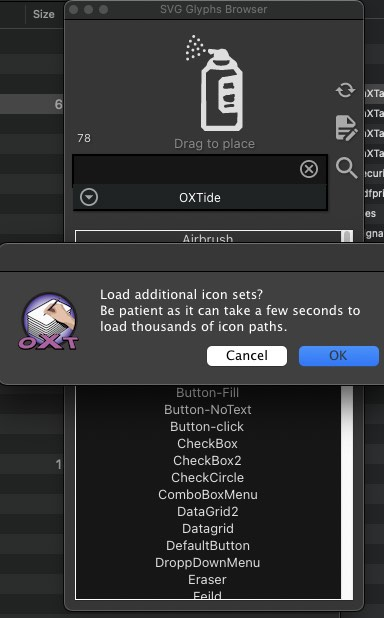
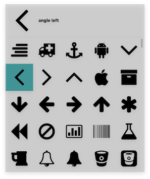

# libSVGicons
This is a library meant to compliment the IconSVG library in the IDE.

A main feature is support for loading SVG Icon sets stored in a simple
tab-seperated-values (TSV) list. These TSV Icon lists can be created from
"-webfont.svg" formated font commonly found on the internet and supported by
tools such as the cross-platform, open-source fontForge application.

Included with the library are several liberally licensed Icon sets,
the biggest of these sets being Google's Material Icon project (v.4.0 currently).
Material Icons set contains 6,063 glyphs so there may be a slight delay
(0.5 second or so) when initially loading that set.

To facilitate browsing such a vast amount of SVG icons, OpenXTalk DPE now includes
a new palette called "SVG Glyphs Browser". For each IDE session, when the user opens
this palette, if the additional icon sets are not already loaded into memory,
a dialog will be presented asking if the additional icons sets should be loaded.

The icons can be drag-n-dropped from this palette onto a stack to place the icon onto a card.

The icons are loaded into memory in the same array format used by the IconSVG library and can be selected using icon-picker widget or used with any other mechanism designed to be compatible with the IconSVG library.

